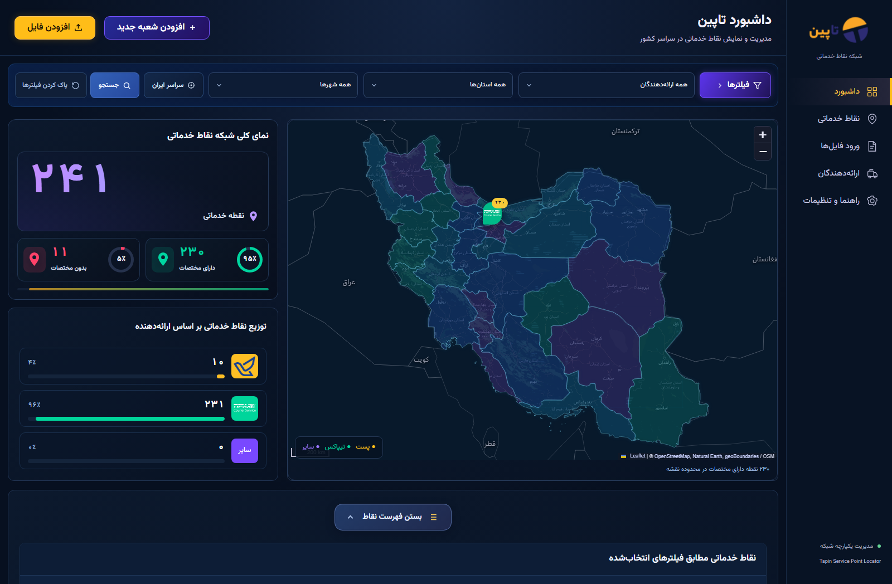
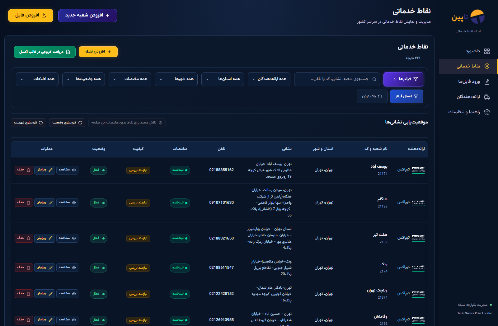
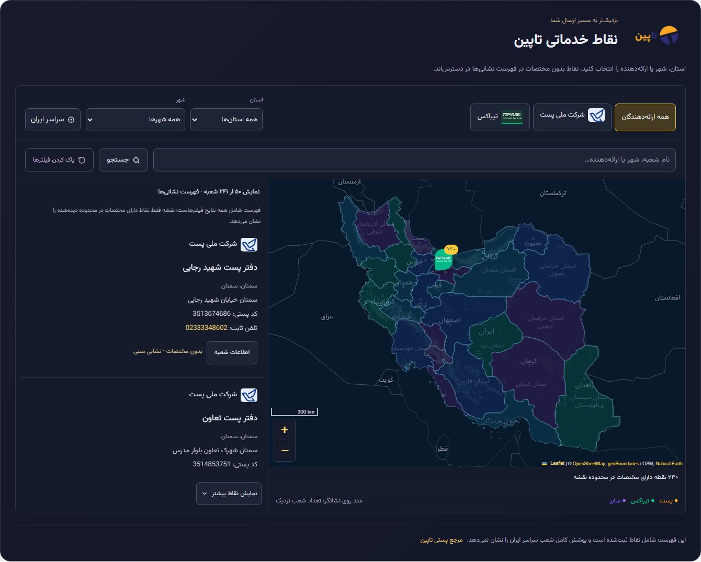

<div align="center">


# Tapin Service Point Locator

**From a branch spreadsheet to a searchable service network.**

A Persian-first WordPress plugin for shipping providers, branch operations and public discovery.


[](LICENSE)

[See the interface](#see-the-interface) · [Features](#built-for-branch-operations) · [Get started](#get-started) · [API](#rest-api) · [Development](#development)

</div>

Tapin brings provider management, CSV/XLSX imports, location enrichment and a public branch finder into one WordPress plugin. Operators work in a dark, Persian RTL dashboard; visitors explore the same published records through a shortcode-powered map and directory.

**An incomplete location should not mean a missing branch.** Address-only records remain searchable and exportable. Only valid locations become map markers—no invented coordinates or city-center fallbacks.

## See the interface

### One view of the network



Filtered totals, coordinate coverage and provider distribution sit beside the operational map. Select a province to focus the map and narrow the directory.

[Watch the 15-second walkthrough →](docs/media/demo.webm) · [View the province-filter screenshot](docs/media/province-filter.png)

The walkthrough follows **dashboard → Tehran filter → service points → file management**. It is a real screen recording supplied as WebM; the screenshots provide GitHub-compatible previews without relying on inline video playback.

<details>
<summary><strong>Explore the service-point table, file manager and public locator</strong></summary>

### Manage branches without leaving the dashboard



Search and filter the table, inspect branch details, edit records or export every matching result—not just the current page.

### Bring existing spreadsheets into the workflow


Upload, preview and map columns before processing. The file manager also houses import outcomes, resumable jobs and recent export activity; this capture shows the upload screen with empty import history.

### Publish a visitor-facing branch finder



Visitors can browse address cards, use telephone links and open branch details, even when a branch has no coordinates.

</details>

Screenshots and video were captured from the running application at source commit `0b898e4`, using the existing local reference dataset. Counts describe that dataset, **not nationwide coverage**. WordPress account controls and local browser chrome are excluded. The hero banner is a concept illustration, not a screenshot. [Media notes](docs/media/README.md)

## Built for branch operations

| Capability | Implemented behavior |
| :--- | :--- |
| **Persian RTL dashboard** | Filter-aware totals, coordinate coverage, Post/Tipax/Other distribution, foldable filters and independently scrolling desktop content. |
| **Branch management** | Create, view, edit and delete records; paginate results; filter by provider, province, city, active status, coordinates and data-quality issues. |
| **Provider registry** | Manage names, slugs, logos, colors and active status. Providers with linked branches cannot be deleted. |
| **Map & directory** | Leaflet province selection, viewport markers, nearby-marker grouping, branch details and a collapsible admin directory with synchronized pagination. |
| **Search** | Match branch names, addresses, codes, phone fields, provinces, cities and provider names through shared repository queries. |
| **CSV/XLSX import** | Private staging, Persian/English column mapping, duplicate policies, resumable batches and downloadable JSON diagnostics. |
| **Filtered XLSX export** | Export all applied filtered results, including address-only records, to an RTL worksheet with text-safe phones and postal codes. |
| **History** | Review import counters and resume interrupted jobs; inspect recent export success/failure events and filter context. |
| **Optional geocoding** | Queue eligible unresolved addresses for server-side Neshan enrichment; preserve valid coordinates and flag ambiguous results for review. |

Administration requires the WordPress `manage_options` capability. Public endpoints expose only active branches belonging to active providers and omit internal metadata and source evidence. The admin operational view can include inactive records.

## Get started

### Prerequisites

| Component | Requirement |
| :--- | :--- |
| WordPress / PHP | WordPress **6.0+**, PHP **7.4+**, JavaScript enabled in the browser |
| Database | WordPress-compatible MySQL/MariaDB with InnoDB transactions and named locks; exports use a consistent read snapshot |
| XLSX support | PHP `ZipArchive`; imports additionally need `XMLReader` and `SimpleXML` |
| Temporary storage | Writable PHP temporary directory **outside the WordPress document root** |
| Development only | Node.js **22.13+** for the locked development dependencies; PowerShell for ZIP packaging |

The plugin header defines compatibility targets, not a claim that every minimum-version combination has been exercised. See the [validation scope](docs/PHASE3-VALIDATION.md).

### Install and run

From your WordPress installation's `wp-content/plugins` directory:

```sh
git clone https://github.com/void-fatima/tapin-service-point-locator.git tapin-service-point-locator
```

Activate **Tapin Service Point Locator** in WordPress, then open **تاپین** in the admin menu. WordPress serves the application: there is no separate frontend server, npm production build or Composer installation. Leaflet, Vazirmatn, logos and geographic assets are bundled.

Prefer an uploadable ZIP? Run this from the repository root on Windows:

```powershell
powershell -ExecutionPolicy Bypass -File scripts/build.ps1
```

Upload `dist/tapin-service-point-locator-1.4.5.zip` through **Plugins → Add New → Upload Plugin**. The packaging script copies runtime files, checks required assets and rejects development/session/config files. It does not run the application test suites.

### Add data, then publish

1. Configure providers and add branches manually, or upload CSV/XLSX using the [CSV column template](assets/import-template.csv).
2. Supply a branch name, province and address. City may remain blank with a warning; coordinates are optional but must be supplied as a pair. For imports, verified postal-source evidence can fill missing fields, including province.
3. Review missing-coordinate and duplicate warnings. Choose **Skip** or **Update** deliberately before processing an import.
4. Add a **Shortcode** block to a public WordPress page:

```text
[tapin_service_points]
```

Activation seeds default providers, not service points. To explicitly import the bundled postal/Tipax reference snapshots, review their [provenance and limitations](docs/DATA-SOURCES.md), then run `wp tapin import-reference` from the WordPress site if WP-CLI is available. These snapshots are not a continuously synchronized national directory.

## Spreadsheet workflow

**Upload → preview → map columns → process batches → review history**

| Format | Supported behavior | Application limits |
| :--- | :--- | :--- |
| CSV import | UTF-8, optional BOM, comma/semicolon/tab separators, quoted newlines | 50 MiB |
| XLSX import | First worksheet, shared or inline strings, values only | 10 MiB compressed / 32 MiB expanded |
| XLSX export | All applied filtered rows, RTL layout, frozen/filterable header, wrapped addresses | 100,000 rows / 64 MiB worksheet XML |

Imports accept up to **100,000 data rows and 64 columns**, subject to host limits. Legacy `.xls`, formulas and multi-sheet selection are unsupported. Keep phone numbers and postal codes as text in the source workbook; the exporter preserves leading zeros and writes formula-like text as text, not executable formulas.

Imports are **browser-driven**, not unattended jobs. Closing the page pauses processing; history lets you resume while staging remains available. A `provider` or `ارائه‌دهنده` column assigns each row to a registered provider by its name, slug or numeric ID, so one file can mix providers. An empty, unknown or ambiguous value fails that row. Files without this column still use the provider dropdown; a workbook whose source links all point to `tipaxco.com` preselects Tipax and rejects a mismatched provider. **Skip** leaves potential duplicates unchanged. **Update** changes only an unambiguous exact branch-code match within the same provider. Completed rows survive cancellation. See [import limits and retention](docs/OPERATIONS.md#import-details-and-limits).

Export history records generation outcomes, not proof that a browser saved the file. It retains recent events for three months; generated workbooks are not archived for re-download, and raw search text is not logged.

## Configuration & privacy

No `.env` file is required by the plugin. WordPress owns database and site configuration.

| Setting / extension point | Purpose |
| :--- | :--- |
| `TAPIN_NESHAN_API_KEY` | Optional PHP process environment variable or private `wp-config.php` constant; the constant takes precedence. Enables server-side geocoding. |
| `TAPIN_NESHAN_PLUS` | Optional PHP constant selecting the Plus endpoint; requires appropriate provider access. |
| `tapin_geocoder` | Server-side filter for an adapter implementing `GeocoderInterface`. |
| `tapin_tile_url`, `tapin_tile_attribution` | WordPress filters for replacing the public tile service and its attribution. |

Without a Neshan key, address-only records remain usable and no Neshan requests are made. Configured enrichment uses WP-Cron, bounded retries and geographic validation; existing valid coordinates are preserved. Low-traffic sites may need a system-triggered WP-Cron schedule. [Geocoding configuration](docs/PHASE2.md)

Uploaded spreadsheets are processed locally. Geocoding sends normalized location/address fields—not phone numbers or import metadata—to the configured provider. Default OpenStreetMap tile requests expose the visitor's IP/referrer to that service; custom logo URLs are also loaded by the browser. Keep credentials out of JavaScript, public tile URLs and version control. Bundled boundaries and the branch directory remain available if tiles fail.

## Architecture & tech stack

A WordPress plugin with a PHP service/repository layer, vanilla JavaScript UI and Leaflet **1.9.4**. WordPress REST routes connect the admin and public interfaces to the same stored records; WP-Cron handles geocoding and retention. Vazirmatn provides the Persian typography. Playwright is development-only.

```text
tapin-service-point-locator/
├── tapin-service-point-locator.php   Bootstrap and lifecycle hooks
├── src/
│   ├── UI/                          Admin shell, shortcode and asset loading
│   ├── Http/                        REST routes and permissions
│   ├── Repository/                  Shared queries and persistence
│   ├── Database/                    Idempotent migrations and write locks
│   ├── Import/                      Staging, mapping, duplicate checks and jobs
│   ├── Export/                      Disk-backed OOXML and download responses
│   ├── Geocoding/                   Provider adapter, validation and queue
│   ├── Normalization/               Persian text, digits and contact fields
│   ├── Validation/                  Record errors and non-blocking warnings
│   └── Service/                     Saves, trusted evidence and event logs
├── assets/                          UI code, libraries, brands and map data
├── scripts/                         Packaging and explicit source-data tools
├── tests/                           PHP, WordPress and browser suites
└── docs/                            Operations, provenance, validation and media
```

Schema version **8** uses six WordPress-prefixed tables: `tapin_providers`, `tapin_service_points`, `tapin_imports`, `tapin_import_points`, `tapin_geocoding_jobs` and `tapin_logs`. Imports commit records, point provenance and checkpoints transactionally; deleting an import removes points created by that file and restores unchanged updates. Exports read a consistent snapshot in bounded batches instead of collecting the entire dataset in browser memory. Upgrading corrects Post-labeled rows whose source URL identifies Tipax.

## REST API

Base path: `/wp-json/tapin/v1/` (or the site's WordPress REST URL). The [route implementation](src/Http/Api.php) is the authoritative reference.

| Endpoint | Access | Purpose |
| :--- | :--- | :--- |
| `GET public/filters` | Public | Active providers and available province/city combinations |
| `GET public/directory` | Public | Paginated branches, including address-only entries |
| `GET public/points` / `public/points/{id}` | Public | Located-point list / public details for an active branch |
| `GET/POST points`, `GET/POST/DELETE points/{id}` | Admin | Query, create, read, update or delete service points |
| `GET/POST providers`, `DELETE providers/{id}` | Admin | Provider registry |
| `GET/POST imports`, `GET imports/{id}` | Admin | Upload, history and job details; POST subroutes `start`, `step`, `cancel` manage jobs |
| `POST exports/points`, `GET exports` | Admin | Binary XLSX download and recent export events |
| `GET geocoding`, `POST geocoding/retry` | Admin | Queue status and explicit retry requests |

List filters include `provider_id`, `province`, `city`, `search`, `page` and `per_page`; admin queries also support status, coordinate and issue filters. Public visibility rules cannot be overridden by query parameters. The admin UI uses WordPress cookie authentication with `X-WP-Nonce`; XLSX export explicitly verifies the nonce as well as `manage_options`.

## Development

Use a **disposable development WordPress site**, not production. Install the plugin there first; PHP CLI must have the same required extensions as the web runtime. LocalWP users can use its Site Shell or pass the site's PHP configuration explicitly.

Standalone logic checks and browser tooling setup:

```sh
php tests/run-checks.php
npm ci
npx playwright install chromium
```

WordPress integration and browser-session example (PowerShell):

```powershell
$env:TAPIN_WP_ROOT = 'C:\path\to\development-wordpress'
php tests/integration.php
$env:TAPIN_SESSION_FILE = Join-Path $env:TEMP 'tapin-browser-session.json'
php tests/browser-session.php
try {
    npm run test:all
    node tests/phase2-ui.cjs
    node tests/phase3-ui.cjs
    php tests/phase3-http.php
} finally {
    php tests/browser-session.php cleanup
}
```

`npm run test:all` runs the six browser suites listed in [package.json](package.json); it is **not** every repository check. Phase 2/3 browser suites are invoked separately above, and the HTTP workbook check follows Phase 3's download. Further targeted PHP suites include `geocoding.php`, `geocoding-integration.php`, `phase1.php` and `phase3.php`. See the [operations guide](docs/OPERATIONS.md#development-and-verification) and [validation record](docs/PHASE3-VALIDATION.md) for scope and prerequisites.

The session helper creates a short-lived local administrator session and may create a shortcode review page. Keep its file private and always run cleanup. Test screenshots and other local artifacts belong in ignored `artifacts/`.

## Status & documentation

Current plugin version: **1.4.5**. Historical validation records document their own environments and limitations; they do not imply that tests were rerun for subsequent UI changes or this README update. The media here demonstrates the current interface, not a test result or production deployment.

| Guide | Contents |
| :--- | :--- |
| [Operations & development](docs/OPERATIONS.md) | Import limits, setup, duplicate rules and retention |
| [Geocoding](docs/PHASE2.md) | Neshan configuration, queue behavior and coordinate protection |
| [Directory & Excel export](docs/PHASE3.md) | Filtered workbooks, accessible directory and history |
| [Data sources](docs/DATA-SOURCES.md) · [Source catalog](docs/TAPIN-SOURCE-CATALOG.md) | Snapshot provenance, reviewed sources and coverage limits |
| [Initial validation](docs/VERIFICATION.md) · [Phase 2](docs/PHASE2-VALIDATION.md) · [Phase 3](docs/PHASE3-VALIDATION.md) | Recorded checks and untested boundaries |
| [Third-party notices](docs/THIRD-PARTY.md) | Libraries, fonts, provider marks and map attribution |

## Data retention & license

Normal deactivation and uninstall **preserve business data**. Defining `TAPIN_UNINSTALL_DROP_DATA` as `true` in private WordPress configuration enables irreversible removal of plugin tables/options during uninstall. Back up the database before destructive operations.

Released under **GPL-2.0-or-later**. See [LICENSE](LICENSE). Bundled libraries, geography and brand assets retain their respective [licenses and attribution](docs/THIRD-PARTY.md); provider trademarks remain with their owners.
