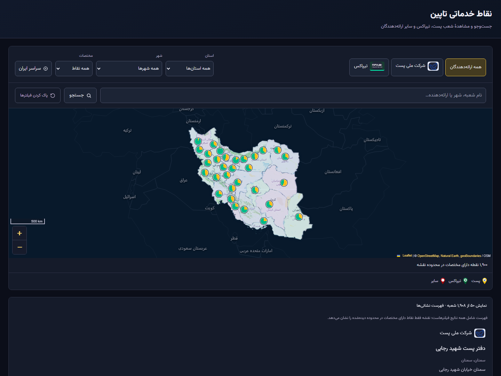
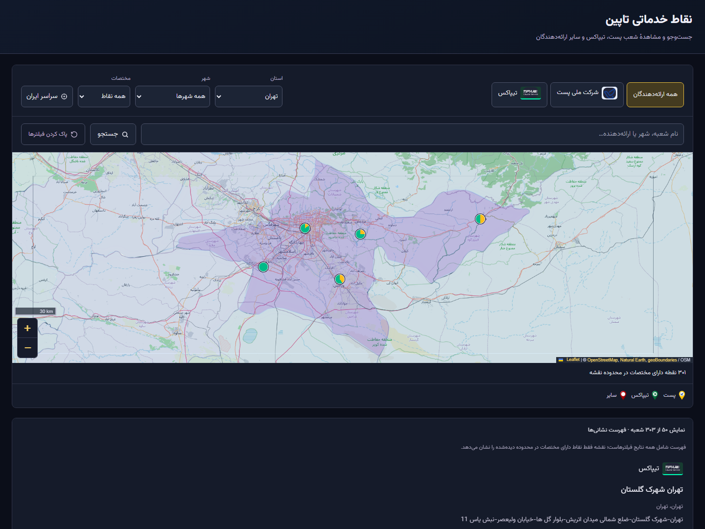

<div align="center">


# سامانهٔ مدیریت و مکان‌یابی نقاط خدماتی تاپین

**Tapin Service Point Locator**

از فایل اطلاعات شعب تا یک شبکهٔ خدماتی قابل جست‌وجو روی نقشه.

**پروژهٔ واقعی توسعه‌یافته برای شرکت تاپین — مستقر روی WordPress**


[](LICENSE)

[مشاهدهٔ سایت](https://iot-core.ir/wordpress_b/?page_id=22) · [پنل مدیریت](https://iot-core.ir/wordpress_b/wp-admin/admin.php?page=tapin-locator) · [ویدیوی دمو](docs/media/public-demo.webm)

**فارسی** · [English](README.en.md)

</div>

**راهنمای مطالعه:** [معرفی](#overview) · [نسخهٔ آنلاین](#live) · [دمو](#demo) · [امکانات](#features) · [معماری](#architecture) · [نصب](#installation) · [ورود داده](#data-workflow) · [API](#api) · [توسعه](#development)

<a id="overview"></a>

## معرفی پروژه

این سامانه برای شرکت **تاپین** ساخته شده تا مدیریت اطلاعات نقاط خدماتی و پیدا کردن شعب ارائه‌دهندگان خدمات پستی در یک بستر مشترک انجام شود. مدیران، اطلاعات شعب را در پنل اختصاصی ثبت، اصلاح، وارد و صادر می‌کنند؛ کاربران، شعب منتشرشده را در فهرست و نقشه جست‌وجو می‌کنند و به نشانی و اطلاعات تماس آن‌ها دسترسی دارند.

پروژه به‌صورت یک افزونهٔ WordPress پیاده‌سازی شده و دارای **پنل مدیریت فارسی، نقشهٔ تعاملی ایران، فهرست عمومی شعب، ورود CSV/XLSX، خروجی Excel و مکان‌یابی اختیاری نشانی‌ها** است. رابط راست‌به‌چپ، فونت فارسی و حالت روشن و تیره برای استفادهٔ روزمره در نظر گرفته شده‌اند.

اصل مهم طراحی داده‌ها: **شعبهٔ بدون مختصات همچنان در فهرست قابل جست‌وجو است.** نشانگر نقشه فقط برای موقعیت معتبر نمایش داده می‌شود؛ مختصات حدسی یا مرکز شهر جایگزین موقعیت شعبه نمی‌شود.

<a id="live"></a>

## نسخهٔ آنلاین

| بخش | آدرس | دسترسی |
| :--- | :--- | :--- |
| پنل کاربران و مکان‌یاب شعب | [مشاهدهٔ سامانهٔ آنلاین](https://iot-core.ir/wordpress_b/?page_id=22) | عمومی؛ بدون نیاز به حساب کاربری |
| پنل مدیریت | [ورود به مدیریت تاپین](https://iot-core.ir/wordpress_b/wp-admin/admin.php?page=tapin-locator) | ورود به WordPress با مجوز `manage_options` |

نسخهٔ عمومی در **۷ اکتبر ۲۰۲۶** از آدرس بالا باز و دموی آن ضبط شده است. پنل مدیریت از احراز هویت و مجوزهای WordPress استفاده می‌کند.

<a id="demo"></a>

## ویدیوی دمو

[](docs/media/public-demo.webm)

**[▶ مشاهدهٔ ویدیوی نسخهٔ آنلاین](docs/media/public-demo.webm)** · **[▶ مشاهدهٔ دموی پنل مدیریت](docs/media/demo.webm)**

| ویدیو | آنچه نمایش می‌دهد | محیط ضبط |
| :--- | :--- | :--- |
| [دموی سایت آنلاین؛ ۴۴ ثانیه](docs/media/public-demo.webm) | نمای ایران ← انتخاب تهران ← فیلتر تیپاکس ← اطلاعات شعبه ← نقاط بدون مختصات ← بازنشانی فیلترها | سایت عمومی دیپلوی‌شده |
| [دموی مدیریت](docs/media/demo.webm) | داشبورد ← فیلتر تهران ← مدیریت نقاط خدماتی ← مدیریت فایل‌ها | نصب محلی مجزا؛ ضبط ۱۵ ثانیه‌ای |

ویدیوها ضبط واقعی رابط برنامه و در قالب **WebM** هستند. لینک ویدیو را باز کنید؛ اگر پیش‌نمایش GitHub در دسترس نبود، فایل را از **View raw / Download** در مرورگر یا پخش‌کنندهٔ سازگار باز کنید. [جزئیات و منشأ رسانه‌ها](docs/media/README.md)

## تصاویر محیط سامانه

### داشبورد مدیریت


داشبورد، تعداد رکوردها، وضعیت مختصات و سهم ارائه‌دهندگان را کنار نقشه نشان می‌دهد. فیلترها امکان تمرکز روی استان، شهر و ارائه‌دهنده را فراهم می‌کنند.

<details>
<summary><strong>مشاهدهٔ جدول شعب، ورود فایل و جزئیات نسخهٔ آنلاین</strong></summary>

### مدیریت نقاط خدماتی


### ورود داده و مدیریت فایل‌ها


### فیلتر استان در سایت آنلاین



### اطلاعات شعبه در سایت آنلاین


</details>

تصاویر مدیریتی از نصب محلی و تصاویر با پیشوند `live-` از سایت آنلاین تهیه شده‌اند. آمار هر تصویر مربوط به داده‌های همان محیط و زمان ضبط است. بنر ابتدای صفحه، تصویر مفهومی پروژه است. [اطلاعات رسانه‌ها](docs/media/README.md)

<a id="features"></a>

## امکانات

| حوزه | قابلیت‌های پیاده‌سازی‌شده |
| :--- | :--- |
| **پنل مدیریت** | داشبورد فارسی RTL، آمار وابسته به فیلتر، وضعیت پوشش مختصات، توزیع ارائه‌دهندگان و نقشه |
| **مدیریت شعب** | ثبت، مشاهده، ویرایش، حذف، صفحه‌بندی و فیلتر بر اساس ارائه‌دهنده، استان، شهر، فعالیت، مختصات و کیفیت داده |
| **مدیریت ارائه‌دهندگان** | نام، Slug، لوگو، رنگ و وضعیت فعالیت؛ جلوگیری از حذف ارائه‌دهندهٔ دارای شعبه |
| **مکان‌یاب عمومی** | نقشهٔ تعاملی ایران، فیلتر استان/شهر/ارائه‌دهنده، جزئیات شعب، لینک تماس و مسیریابی با نشان، بلد و Google Maps برای موقعیت‌های معتبر |
| **جست‌وجو** | نام شعبه، نشانی، کد، شماره تماس، استان، شهر و نام ارائه‌دهنده |
| **نمایش روی نقشه** | دریافت نقاط محدودهٔ قابل مشاهده، تجمیع نشانگرهای نزدیک و نمایش هویت ارائه‌دهندگان |
| **ورود CSV/XLSX** | پیش‌نمایش، نگاشت ستون‌های فارسی و انگلیسی، اعتبارسنجی، تشخیص تکرار و پردازش دسته‌ای قابل ادامه |
| **ورود چند ارائه‌دهنده** | تعیین ارائه‌دهندهٔ هر ردیف با ستون `provider`؛ ورود فایل مشترک چند ارائه‌دهنده |
| **خروجی Excel** | همهٔ نتایج منطبق با فیلتر، Worksheet راست‌به‌چپ، عنوان ثابت و حفظ صفر ابتدای کدها و تلفن‌ها |
| **تاریخچهٔ عملیات** | گزارش ورود، شمارندهٔ خطا و هشدار، ادامهٔ پردازش، گزارش JSON و رویدادهای تولید خروجی |
| **کیفیت اطلاعات** | یکسان‌سازی نویسه‌ها و ارقام فارسی/عربی، بررسی تماس و کد پستی، اعتبارسنجی مختصات و موارد نیازمند بررسی |
| **تکمیل موقعیت** | مکان‌یابی اختیاری Neshan در سمت سرور، صف WP-Cron، تلاش مجدد و حفاظت از مختصات معتبر موجود |
| **رابط کاربری** | فونت Vazirmatn، حالت روشن/تیره، رابط واکنش‌گرا و کنترل‌های قابل استفاده با صفحه‌کلید |

## گردش کار

**مدیر سامانه:** تعریف ارائه‌دهنده ← ثبت دستی یا بارگذاری فایل ← نگاشت و بررسی ستون‌ها ← پردازش و مرور نتایج ← اصلاح اطلاعات ← انتشار شعب فعال.

**کاربر عمومی:** انتخاب ارائه‌دهنده، استان یا شهر ← جست‌وجوی شعبه ← مشاهدهٔ فهرست یا نقشه ← باز کردن اطلاعات شعبه ← استفاده از نشانی و شماره تماس.

فهرست عمومی فقط **شعب فعالِ ارائه‌دهندگان فعال** را نشان می‌دهد. رکوردهای فاقد مختصات از فهرست حذف نمی‌شوند. پنل مدیریتی امکان بررسی رکوردهای غیرفعال را هم دارد.

<a id="architecture"></a>

## فناوری‌ها و معماری

| لایه | فناوری و مسئولیت |
| :--- | :--- |
| بستر اجرا | WordPress؛ چرخهٔ افزونه، مجوزها، Shortcode و WP-Cron |
| بک‌اند | PHP؛ سرویس‌ها، Repository، اعتبارسنجی و REST API |
| ذخیره‌سازی | MySQL/MariaDB؛ جداول اختصاصی با پیشوند سایت و تراکنش‌های InnoDB |
| رابط کاربری | JavaScript بدون فریم‌ورک، CSS و رابط فارسی RTL |
| نقشه | Leaflet **1.9.4**، هندسهٔ استان‌های ایران و تصاویر زمینهٔ OpenStreetMap |
| فونت | Vazirmatn **33.0.3**؛ فایل‌های محلی |
| Excel | خواندن XLSX و تولید OOXML در PHP؛ بدون سرویس پردازش فایل خارجی |
| آزمون مرورگر | Playwright **1.55.1**؛ وابستگی محیط توسعه |

پنل مدیریت و مکان‌یاب عمومی از یک لایهٔ ذخیره‌سازی استفاده می‌کنند. داده‌ها از REST API خوانده می‌شوند و قواعد انتشار عمومی در بک‌اند اعمال می‌شوند. ورود فایل، ذخیرهٔ رکورد و نقطهٔ ادامه را در تراکنش انجام می‌دهد. خروجی Excel از یک نمای سازگار پایگاه داده و در دسته‌های محدود تولید می‌شود.

```text
tapin-service-point-locator/
├── tapin-service-point-locator.php   ورودی افزونه و چرخهٔ فعال‌سازی
├── uninstall.php                    سیاست حذف افزونه و نگهداری داده
├── src/
│   ├── UI/                          پنل، Shortcode و قالب عمومی
│   ├── Http/                        مسیرهای REST و مجوزهای دسترسی
│   ├── Repository/                  جست‌وجو و ذخیرهٔ داده
│   ├── Database/                    مهاجرت ساختار و قفل نوشتن
│   ├── Import/                      پیش‌نمایش، نگاشت و پردازش فایل
│   ├── Export/                      تولید Workbook و دانلود
│   ├── Geocoding/                   مکان‌یابی، اعتبارسنجی و صف
│   ├── Normalization/               یکسان‌سازی متن و شماره‌ها
│   ├── Validation/                  خطاها و هشدارهای رکورد
│   └── Service/                     منطق عملیات، شواهد و رویدادها
├── assets/                          رابط، فونت، لوگو و دادهٔ جغرافیایی
├── scripts/                         بسته‌بندی، ابزارهای داده و ضبط دمو
├── tests/                           آزمون‌های PHP، WordPress و مرورگر
└── docs/                            راهنماها، منابع داده و رسانه‌ها
```

نسخهٔ فعلی افزونه **1.4.7** و نسخهٔ ساختار پایگاه داده **9** است. نام جداول با پیشوند نصب WordPress ساخته می‌شود:

| جدول | کاربرد |
| :--- | :--- |
| `tapin_providers` | ارائه‌دهندگان |
| `tapin_service_points` | اطلاعات شعب، تماس، مختصات، منبع و کیفیت داده |
| `tapin_imports` | تاریخچه و وضعیت پردازش فایل‌ها |
| `tapin_import_points` | ارتباط رکوردها با فایل و تغییرات ورود |
| `tapin_geocoding_jobs` | صف و وضعیت مکان‌یابی |
| `tapin_logs` | رویدادهای عملیاتی و خروجی‌ها |

<a id="installation"></a>

## نصب و راه‌اندازی

### پیش‌نیازها

| مورد | نیازمندی |
| :--- | :--- |
| WordPress / PHP | WordPress **6.0+** و PHP **7.4+** مطابق هدر افزونه |
| پایگاه داده | MySQL/MariaDB سازگار؛ پشتیبانی از InnoDB و Named Lock |
| ورود Excel | افزونه‌های PHP: `ZipArchive`، `XMLReader` و `SimpleXML` |
| خروجی Excel | `ZipArchive` |
| فایل موقت | پوشهٔ قابل نوشتن PHP، خارج از مسیر عمومی WordPress |
| مرورگر | JavaScript فعال؛ اینترنت برای تصاویر زمینهٔ نقشه |
| توسعه | Node.js **22.13+** برای وابستگی‌های قفل‌شده؛ PowerShell برای بسته‌بندی |

حداقل نسخه‌ها، اهداف سازگاری اعلام‌شده در افزونه‌اند. محیط‌ها و دامنهٔ بررسی عملی در [گزارش اعتبارسنجی](docs/PHASE3-VALIDATION.md) ثبت شده‌اند.

### نصب از ZIP

در ریشهٔ مخزن اجرا کنید:

```powershell
powershell -ExecutionPolicy Bypass -File scripts/build.ps1
```

خروجی در `dist/tapin-service-point-locator-1.4.7.zip` ساخته می‌شود. در WordPress از مسیر **افزونه‌ها ← افزودن افزونه ← بارگذاری افزونه** آن را نصب و فعال کنید؛ سپس وارد منوی **تاپین** شوید.

### نصب از سورس

در مسیر `wp-content/plugins` نصب WordPress:

```sh
git clone https://github.com/void-fatima/tapin-service-point-locator.git tapin-service-point-locator
```

افزونهٔ **Tapin Service Point Locator** را از پیشخوان فعال کنید. اجرای سایت به نصب npm یا Composer و سرور جداگانهٔ فرانت‌اند نیاز ندارد؛ کتابخانهٔ نقشه، فونت‌ها، لوگوها و هندسهٔ جغرافیایی همراه افزونه هستند.

### فعال‌سازی پنل عمومی

در یک برگهٔ WordPress، بلوک Shortcode بسازید:

```text
[tapin_service_points]
```

نمای پیش‌فرض در برگه، مکان‌یاب تمام‌صفحه است. برای قرار دادن آن در قالب معمول سایت:

```text
[tapin_service_points layout="embedded"]
```

ارائه‌دهندگان و شعب را در پنل ثبت یا وارد کنید. فعال‌سازی افزونه، ارائه‌دهندگان پیش‌فرض را ایجاد می‌کند؛ ورود اطلاعات شعب جداگانه انجام می‌شود.

<a id="data-workflow"></a>

## ورود و خروج داده

### آماده‌سازی فایل

از [قالب CSV](assets/import-template.csv) شروع کنید. نام شعبه، استان، نشانی و ارائه‌دهندهٔ معتبر ضروری‌اند. شهر می‌تواند با هشدار خالی بماند. مختصات اختیاری‌اند؛ عرض و طول جغرافیایی باید با هم وارد شوند.

| ستون | توضیح |
| :--- | :--- |
| `provider` | نام، Slug یا شناسهٔ ارائه‌دهندهٔ ثبت‌شده؛ در فایل فاقد این ستون، انتخاب پنل استفاده می‌شود |
| `code`, `name` | کد و نام شعبه |
| `province`, `city`, `address` | استان، شهر و نشانی |
| `phone`, `mobile_phone`, `landline_phone` | تماس عمومی، همراه و ثابت |
| `postal_code` | کد پستی؛ در Excel با نوع متن نگهداری شود |
| `latitude`, `longitude` | زوج مختصات جغرافیایی |
| `status` | `active` یا `inactive` |
| `source`, `metadata` | منبع و اطلاعات تکمیلی برای پردازش داخلی |

نام‌های شناخته‌شدهٔ فارسی و انگلیسی ستون‌ها تشخیص داده می‌شوند و نگاشت پیش از پردازش قابل اصلاح است. ستون `provider` امکان ورود چند ارائه‌دهنده در یک فایل را می‌دهد؛ مقدار خالی، ناشناخته یا مبهم باعث خطای همان ردیف می‌شود.

### مراحل پردازش

1. فایل CSV یا XLSX را بارگذاری کنید.
2. پیش‌نمایش و نگاشت ستون‌ها را بررسی کنید.
3. سیاست برخورد با دادهٔ تکراری را انتخاب کنید.
4. پردازش دسته‌ها را اجرا و خطاها و هشدارها را مرور کنید.
5. در صورت وقفه، عملیات را از تاریخچه ادامه دهید؛ گزارش JSON برای بررسی جزئیات در دسترس است.

**Skip** رکوردهای مشکوک به تکرار را بدون تغییر کنار می‌گذارد. **Update** فقط در صورت تطبیق دقیق و غیرمبهم کد شعبه در همان ارائه‌دهنده، رکورد موجود را تغییر می‌دهد. اشتراک تلفن به‌تنهایی باعث بازنویسی نمی‌شود.

پردازش ورود فایل با درخواست‌های مرورگر انجام می‌شود؛ بستن صفحه آن را متوقف می‌کند. ادامهٔ عملیات تا زمانی ممکن است که فایل موقت باقی باشد. لغو عملیات، ردیف‌های ثبت‌شده را نگه می‌دارد. حذف ورود از تاریخچه، تغییرات مرتبط را با بررسی Snapshot و زنجیرهٔ فایل‌ها بازمی‌گرداند؛ رکوردی که بعداً تغییر کرده، در این مرحله حفظ می‌شود.

در نسخهٔ فعلی، حذف آخرین ورود تکمیل‌شده یا لغوشده، رکوردهای بدون پیوند فایل را هم پاک می‌کند؛ این موارد می‌توانند شامل دادهٔ قدیمی یا ثبت دستی باشند. پیش از حذف تاریخچه، از پایگاه داده پشتیبان بگیرید. [مرجع رفتار حذف](src/Import/ImportJobs.php)

### محدودیت‌ها و خروجی

| فرمت | پشتیبانی | سقف برنامه |
| :--- | :--- | :--- |
| CSV | UTF-8، BOM اختیاری، ویرگول/نقطه‌ویرگول/Tab و متن چندخطی نقل‌قول‌شده | **50 MiB** |
| XLSX | نخستین Worksheet، مقادیر، Shared String و Inline String | **10 MiB** فشرده / **32 MiB** بازشده |
| خروجی XLSX | همهٔ ردیف‌های منطبق با فیلتر؛ شامل نقاط بدون مختصات | **100,000** ردیف / **64 MiB** XML صفحه |

ورود تا **100,000 ردیف و 64 ستون** مجاز است؛ هاست و PHP ممکن است سقف کمتری اعمال کنند. فایل `.xls`، فرمول‌ها و انتخاب چند Worksheet پشتیبانی نمی‌شوند. تلفن، کد شعبه و کد پستی را به‌صورت متن نگهداری کنید.

خروجی Excel به صفحهٔ فعلی جدول محدود نیست. متن شبیه فرمول به‌صورت متن نوشته می‌شود. تاریخچهٔ خروجی، نتیجهٔ تولید فایل را ثبت می‌کند؛ فایل برای دانلود مجدد آرشیو نمی‌شود. [جزئیات عملیاتی](docs/OPERATIONS.md)

## تنظیمات نقشه و مکان‌یابی

پیکربندی پایگاه داده به WordPress سپرده شده و افزونه به `.env` نیاز ندارد. برای مکان‌یابی اختیاری، کلید خصوصی Neshan را در `wp-config.php` قرار دهید:

```php
define( 'TAPIN_NESHAN_API_KEY', 'YOUR_PRIVATE_NESHAN_API_KEY' );
```

متغیر محیطی PHP با همین نام نیز پشتیبانی می‌شود؛ ثابت PHP اولویت دارد. بدون کلید، درخواست Neshan ارسال نمی‌شود و نقاط بدون مختصات همچنان قابل استفاده‌اند.

| تنظیم / Hook | کاربرد |
| :--- | :--- |
| `TAPIN_NESHAN_API_KEY` | کلید خصوصی مکان‌یابی سمت سرور |
| `TAPIN_NESHAN_PLUS` | انتخاب endpoint نوع Plus، در صورت دسترسی سرویس |
| `tapin_geocoder` | جایگزینی آداپتر با پیاده‌سازی `GeocoderInterface` |
| `tapin_tile_url`, `tapin_tile_attribution` | تغییر سرویس تصاویر زمینه و انتساب آن |

مکان‌یابی از WP-Cron، تلاش مجدد محدود و اعتبارسنجی جغرافیایی استفاده می‌کند. مختصات معتبر موجود حفظ می‌شوند و نتیجهٔ مبهم برای بررسی باقی می‌ماند. سایت کم‌ترافیک می‌تواند اجرای WP-Cron را با زمان‌بند سرور تنظیم کند. [راهنمای مکان‌یابی](docs/PHASE2.md)

<a id="api"></a>

## REST API

Namespace افزونه **`tapin/v1`** است. مسیر معمول `/wp-json/tapin/v1/` است؛ در نصب‌هایی با پیوند یکتای متفاوت، URL تولیدشده توسط `rest_url()` ملاک است.

### مسیرهای عمومی

| متد | مسیر | کاربرد |
| :--- | :--- | :--- |
| `GET` | `/public/filters` | ارائه‌دهندگان فعال و ترکیب استان/شهر |
| `GET` | `/public/directory` | فهرست صفحه‌بندی‌شده؛ شامل شعب بدون مختصات |
| `GET` | `/public/points` | نقاط دارای موقعیت برای نقشه |
| `GET` | `/public/points/{id}` | جزئیات عمومی یک شعبهٔ فعال |

### مسیرهای مدیریت

| متد | مسیر | کاربرد |
| :--- | :--- | :--- |
| `GET` | `/dashboard`, `/locations` | خلاصهٔ داشبورد و فهرست موقعیت‌ها |
| `GET`, `POST` | `/points` | جست‌وجو و ایجاد شعبه |
| `GET`, `POST`, `DELETE` | `/points/{id}` | مشاهده، ویرایش و حذف شعبه |
| `GET` | `/points/{id}/details` | جزئیات مدیریتی شعبه |
| `DELETE` | `/points/reset` | حذف همهٔ نقاط خدماتی |
| `GET`, `POST` | `/providers` | فهرست، ایجاد یا به‌روزرسانی ارائه‌دهنده |
| `DELETE` | `/providers/{id}` | حذف ارائه‌دهندهٔ بدون شعبه |
| `GET`, `POST` | `/imports` | تاریخچه و بارگذاری فایل |
| `GET`, `DELETE` | `/imports/{id}` | وضعیت ورود یا حذف عملیات و اعمال قواعد بازگردانی آن |
| `POST` | `/imports/{id}/start`, `/imports/{id}/step`, `/imports/{id}/cancel` | شروع، پردازش دستهٔ بعدی و لغو |
| `POST` | `/exports/points` | تولید و دانلود XLSX |
| `GET` | `/exports`, `/geocoding` | تاریخچهٔ خروجی و وضعیت صف مکان‌یابی |
| `POST` | `/geocoding/retry` | تلاش مجدد مکان‌یابی |

فیلترهای مشترک شامل `provider_id`، `province`، `city`، `search`، `page` و `per_page` هستند. فهرست عمومی از `has_coordinates` نیز پشتیبانی می‌کند؛ مدیریت فیلترهای `status` و `issue` را هم دارد. درخواست نقشه می‌تواند حدود `north`، `south`، `east` و `west` را ارسال کند.

پنل از نشست WordPress و هدر `X-WP-Nonce` استفاده می‌کند. تمام مسیرهای مدیریت به `manage_options` نیاز دارند. قواعد انتشار عمومی با پارامترهای درخواست قابل دور زدن نیستند. [مرجع مسیرها در کد](src/Http/Api.php)

## امنیت، حریم خصوصی و نگهداری

- فایل‌های ورودی در فضای موقت خصوصی پردازش می‌شوند و برای تبدیل فایل به سرویس خارجی ارسال نمی‌شوند.
- پاسخ عمومی، metadata داخلی و شواهد منبع را منتشر نمی‌کند.
- مکان‌یابیِ فعال‌شده، موقعیت و نشانی نرمال‌شده را به سرویس می‌فرستد؛ تلفن و metadata فایل ارسال نمی‌شوند.
- دریافت تصاویر OpenStreetMap، IP و Referrer مرورگر را به آن سرویس می‌رساند. لوگوهای سفارشی نیز در مرورگر بارگذاری می‌شوند.
- فایل موقتِ عملیات تکمیل‌شده یا لغوشده فوراً پاک می‌شود؛ عملیات رهاشده پس از **۲۴ ساعت** از طریق Cron یا بارگذاری بعدی منقضی می‌شود.
- رویدادهای عملیاتی پس از **سه ماه** پاک‌سازی می‌شوند. تاریخچهٔ ورود، سیاست نگهداری جداگانه دارد.
- غیرفعال‌سازی و حذف معمول افزونه، داده‌های کسب‌وکار را حفظ می‌کند. حذف جداول و تنظیمات هنگام uninstall فقط با فعال‌سازی صریح `TAPIN_UNINSTALL_DROP_DATA` انجام می‌شود.

پیش از ارتقا یا حذف داده، نسخهٔ پشتیبان پایگاه داده تهیه کنید. کلیدهای خصوصی را در پیکربندی سرور نگه دارید و انتساب سرویس نقشه را حفظ کنید. [راهنمای نگهداری](docs/OPERATIONS.md)

<a id="development"></a>

## توسعه و آزمون

آزمون‌های یکپارچگی و مرورگر را روی **نصب توسعهٔ مجزا** اجرا کنید. ابزار نشست آزمون، دسترسی کوتاه‌مدت مدیریتی ایجاد می‌کند و ممکن است برگهٔ بررسی Shortcode بسازد.

```sh
php tests/run-checks.php
npm ci
npx playwright install chromium
```

نمونهٔ اجرای آزمون WordPress و رابط در PowerShell، با PHP و افزونه‌های موردنیاز در PATH:

```powershell
$env:TAPIN_WP_ROOT = 'C:\path\to\development-wordpress'
php tests/integration.php
$env:TAPIN_SESSION_FILE = Join-Path $env:TEMP 'tapin-browser-session.json'
php tests/browser-session.php
try {
    npm run test:all
    node tests/phase2-ui.cjs
    node tests/phase3-ui.cjs
    php tests/phase3-http.php
} finally {
    php tests/browser-session.php cleanup
}
```

`npm run test:all` شش مجموعهٔ تعریف‌شده در [package.json](package.json) را اجرا می‌کند. آزمون‌های PHP تکمیلی در `tests/` قرار دارند. `tests/public-page.php` قالب عمومی را بدون پایگاه داده و با فایل‌های نصب WordPress بررسی می‌کند.

گزارش‌های [اعتبارسنجی اولیه](docs/VERIFICATION.md)، [فاز ۲](docs/PHASE2-VALIDATION.md) و [فاز ۳](docs/PHASE3-VALIDATION.md) محیط و نتایج همان مرحله را ثبت می‌کنند. ضبط دمو و به‌روزرسانی README به معنای اجرای دوبارهٔ همهٔ آزمون‌ها نیست.

### ضبط مجدد دموی عمومی

پس از نصب وابستگی‌ها و Chromium:

```sh
node scripts/record-demo.cjs
```

برای نصب دیگر، متغیر محیطی `TAPIN_DEMO_URL` را تنظیم کنید. اسکریپت با دسترسی ناشناس از کنترل‌های عمومی استفاده می‌کند و ویدیو و تصاویر را در `docs/media/` ذخیره می‌کند. ضبط، دادهٔ سایت را تغییر نمی‌دهد.

## منابع داده و مستندات

اطلاعات محیط آنلاین به داده‌های واردشده توسط مدیر سامانه وابسته است. منابع مرجع همراه مخزن، Snapshotهای منطقه‌ای و بررسی‌شده‌اند و خودکار همگام‌سازی نمی‌شوند. پس از مطالعهٔ منشأ داده، ورود صریح آن با `wp tapin import-reference` و WP-CLI امکان‌پذیر است.

هندسهٔ استان‌ها برای نمایش نقشه است و مرجع رسمی آخرین تغییرات تقسیمات کشوری نیست. هنگام اختلال تصاویر زمینه، هندسهٔ محلی و فهرست شعب قابل استفاده می‌مانند. پشتیبانی از حداقل نسخه‌ها و Multisite را مطابق دامنهٔ گزارش‌های آزمون ارزیابی کنید.

| مستند | موضوع |
| :--- | :--- |
| [Operations](docs/OPERATIONS.md) | نصب توسعه، محدودیت فایل، ادامهٔ پردازش و نگهداری |
| [Geocoding](docs/PHASE2.md) | تنظیم Neshan، صف و حفاظت از مختصات |
| [Directory & Export](docs/PHASE3.md) | فهرست شعب، خروجی Excel و تاریخچه |
| [Data Sources](docs/DATA-SOURCES.md) | منشأ و محدودیت دادهٔ مرجع |
| [Source Catalog](docs/TAPIN-SOURCE-CATALOG.md) | منابع بررسی‌شده و اسناد استان‌ها |
| [Media](docs/media/README.md) | ویدیوها، تصاویر و شرایط ضبط |
| [Third-party Notices](docs/THIRD-PARTY.md) | مجوز کتابخانه‌ها، فونت، نقشه و علائم تجاری |

## توسعه‌دهنده و مجوز

توسعه توسط **[void-fatima](https://github.com/void-fatima)** برای **شرکت تاپین** انجام شده است. این مخزن، کد و مستندات پروژهٔ واقعی را در کنار نسخهٔ آنلاین و دموی آن ارائه می‌کند.

کد افزونه تحت مجوز **GPL-2.0-or-later** منتشر شده است؛ متن کامل در [LICENSE](LICENSE) قرار دارد. کتابخانه‌ها، فونت، داده‌های جغرافیایی و لوگوهای همراه، مجوزها و انتساب‌های خود را دارند. حقوق علائم تجاری تاپین، پست و تیپاکس متعلق به صاحبان آن‌هاست.
